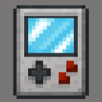
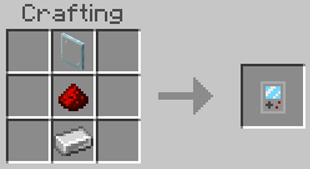
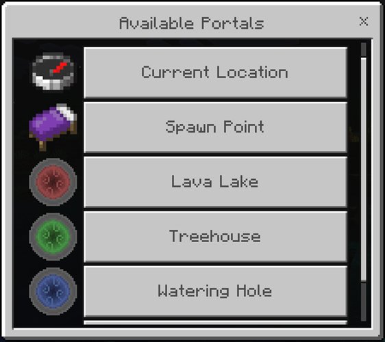
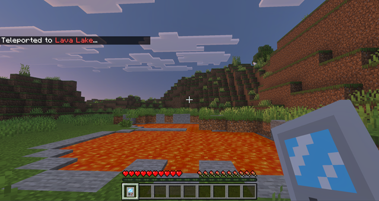

# PortalPal

A Minecraft Bedrock add-on for teleportation.

PortalPal allows a user of the device to do the following:

1.  Teleport to other players.
2.  Teleport to your own spawn point, or those belonging to other players.
3.  Add, edit, and delete custom portals to telelport to.
4.  Teleport to the portals of other players (as long as they are not private).

## How to Get a PortalPal

### Crafting

To craft a PortalPal, you need the following 3 items:

1. A glass pane
2. Redstone
3. An iron ingot

Arrange them in the following pattern:

### Creative Mode

To give yourself a PortalPal, type the following command in the chat window:

`/give @s pp:portal_pal`

## Screenshots

## Future Enhancements

A short list of potential features for future versions of the add-on:

-   When teleporting to another player, don't teleport directly on top of them. Find the nearest safe, open location that is at least a block or two away.
-   Allow teleporting to portals belonging to players that are not in the game.
-   Improve the playing of the teleportation sound effect so that it plays for everyone in the vicinity (outgoing and incoming).

## Information for Developers / Contributors / Maintainers

### Minecraft Modules

This add-on is highly dependent on the versions of the "@minecraft/server" and "@minecraft/server-ui" modules offered by the [Minecraft Bedrock Script API](https://learn.microsoft.com/en-us/minecraft/creator/scriptapi/?view=minecraft-bedrock-experimental). If you need to bump them to a version supported by the current game, they are specified in "development_behavior_packs\portal_pal_BP\manifest.json" under the "dependencies" object.

### PortalPal Version Number

When releasing a new version of PortalPal, bump the "header" -> "version" in the following files:

1.  development_behavior_packs\portal_pal_BP\manifest.json
2.  development_resource_packs\portal_pal_RP\manifest.json

Follow [Semantic Versioning](https://semver.org/) rules.

### Packaging

Minecraft Bedrock supports the .mcaddon format. This is just a zip file with a different extension. Follow the following instructions to make a new release:

1.  Copy the following folders:
    -   portal_pal_BP
    -   portal_pal_RP
2.  Zip them up.
3.  Rename the extension from .zip to .mcaddon.

### Dependencies

This project uses a handful of [Node.js](https://nodejs.org/en) packages for [TypeScript](https://www.typescriptlang.org/) support. To get them, run `npm install` after cloning the repository. Run `npm update` at any time to get the most recent versions.

## Credits

Portal icons by [PixelZoink and actuallyKron](https://actuallykron.itch.io/32x32-2d-portal-asset-pack). Licensed under [CC0 1.0 Universal](https://creativecommons.org/publicdomain/zero/1.0/).
